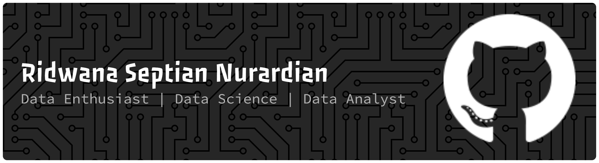

```markdown
# Hi there, I'm Ridwana Septian Nurardian 👋  

<!-- 
🎓 Mahasiswa Informatika di **Universitas Bina Sarana Informatika (UBSI)**  
💡 Passionate about **Data Science | Machine Learning | Artificial Intelligence**  
🌱 Currently learning **Python, PostgreSQL, Streamlit, TensorFlow, Flask**  
📊 Love working on **Data Analysis, Visualization, and Predictive Modeling**  
🌍 Open to collaboration on **AI/Data Science projects**  

---

## 🌐 Connect with Me


---

## 🛠️ Tech Stack & Tools

**Languages & Databases**  
[](https://skillicons.dev)
<!-- 


 -->

**Frameworks & Libraries**  


  


  
  
  

---

## 🚀 Featured Projects

- 🏅 **Gold Price Prediction (Time Series)**  
  Predicting gold prices using **LSTM, ARIMA, GRU, and XGBoost** models.  

- 📈 **Bitcoin Sentiment Analysis**  
  Analyzing the impact of the Iran–Israel conflict on Bitcoin volatility using **Twitter/X API**.  

- 🗺️ **Land Price Prediction (IDW Method)**  
  Web application built with **Streamlit** to visualize and predict land prices.  

---

## 📊 GitHub Stats

  
  

---

## 🌍 Bahasa Indonesia Version

Halo 👋, saya **Ridwana Septian Nurardian**  
Saya seorang mahasiswa **Informatika UBSI** yang bersemangat dalam dunia **Data Science, Machine Learning, dan Artificial Intelligence**.  
Saat ini saya mendalami **Python, PostgreSQL, dan Streamlit** serta mengerjakan berbagai proyek analisis data.  

Mari terhubung di LinkedIn saya dan berdiskusi tentang data, AI, atau kolaborasi proyek 🚀  

---
✨ *"Turning data into insight, and insight into impact."* ✨
``` -->
# 💫 About Me:
🎓 Mahasiswa Informatika di **Universitas Bina Sarana Informatika (UBSI)**  <br>💡 Passionate about **Data Science | Machine Learning | Artificial Intelligence**  <br>🌱 Currently learning **Python, PostgreSQL, Streamlit, TensorFlow, Flask**  <br>📊 Love working on **Data Analysis, Visualization, and Predictive Modeling**  <br>🌍 Open to collaboration on **AI/Data Science projects** 


## 🌐 Socials:
[](https://instagram.com/ridwana.septian) [](https://linkedin.com/in/ridwanaseptian) [](mailto:ridwanaseptian@gmail.com) 

# 💻 Tech Stack:
                 
# 📊 GitHub Stats:
<br/>
<br/>


---
[](https://visitcount.itsvg.in)

<!-- Proudly created with GPRM ( https://gprm.itsvg.in ) -->
